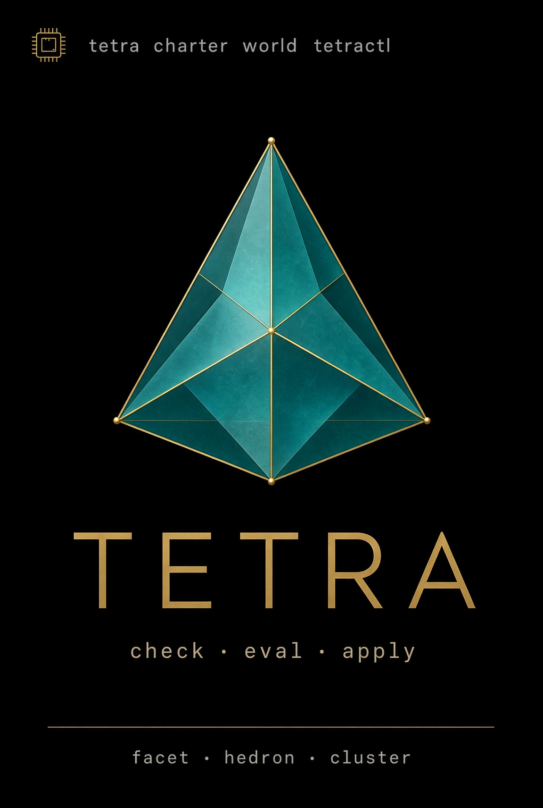

<p align="center">
  <a href="https://github.com/VirtualMachinist/tetra-cli">
    
  </a>
</p>

<h1 align="center">Tetra</h1>

<p align="center">
  <strong>The world command of the Hedronite platform.</strong><br>
  Nickel is the language. <code>tetractl</code> is the verb. Facet, HedronDB, and h3s stay engines.
</p>

<p align="center">
  <a href="https://crates.io/crates/tetractl"></a>
  <a href="https://rustup.rs"></a>
  <a href="LICENSE"></a>
</p>

<p align="center">
  <a href="#quick-start">Quick start</a> ·
  <a href="#what-you-get">What you get</a> ·
  <a href="#how-it-works">How it works</a> ·
  <a href="#status">Status</a> ·
  <a href="#contributing">Contributing</a>
</p>

<p align="center">
  Built by <a href="https://hedronite.com">Hedronite</a>'s <a href="https://github.com/VirtualMachinist">VirtualMachinist</a>.
</p>

---

**Tetra** is a verbiage wrapper. Operators and agents type `tetractl`, not `facet ncl` + `hedron` HQL + `kubectl`. Facet still embeds Nickel. HedronDB still records intent. h3s + kubectl still own Ready. Tetra fills the gaps those engines do not have: `doctor`, `session`, `status`, `diff`, `blame`.

```
tetra      — the binary
tetractl   — the kubectl-shaped alias of that same binary
```

It is not a second Nickel VM, not a kubectl clone, and not an MCP server (yet).

| | Pin |
|---|---|
| Binary | `tetractl` / `tetra` ([`tetractl`](https://crates.io/crates/tetractl) 0.0.1) |
| Nickel host | Facet crate [`hedron-ncl`](https://crates.io/crates/hedron-ncl) — **not** this repo |
| Lattice history | [`facet-lattice`](https://crates.io/crates/facet-lattice) — different axis; there is no `facet-ncl` |
| MSRV | 1.83 |
| License | [Apache-2.0](LICENSE) |

## Quick start

Rust **1.83+**. `facet` must be on `PATH` for wrap verbs (`check` / `eval` / `apply`). `hedron` and `kubectl` are optional until you ask for intent or cluster.

```sh
cargo install tetractl
# from a clone: cargo run --bin tetractl --
```

```text
tetractl doctor
tetractl session start
tetractl check worlds/prod.ncl
tetractl eval  worlds/prod.ncl --json
tetractl apply worlds/prod.ncl --dry-run --json
tetractl status worlds/prod.ncl
tetractl diff   worlds/prod.ncl
tetractl blame  '<Status JSON or kubectl stderr>'
```

`TETRA_SESSION` is a Facet session ULID (`FACET_SESSION`). `--json` emits Facet JSON (`schemaVersion: 1`). Extra flags after the world path are forwarded to `facet ncl`.

crates.io name `tetra` is a game framework. Install **`tetractl`**. Both bins come from that crate.

## What you get

| You type | Engine |
|---|---|
| `tetractl check` / `eval` / `apply` | `facet ncl check` / `export` / `apply` |
| intent status of names | HedronDB HQL |
| cluster get / Ready | `kubectl` on the host that has kubeconfig |
| `doctor` `session` `status` `diff` `blame` | Tetra only |

`facet ncl` remains the engine CLI for debug. Hash and exit parity with that surface is the wrap contract.

### What you do not get

| Claim | Reality |
|---|---|
| A second Nickel VM | No `nickel-lang-core` / `hedron-ncl` in this lockfile |
| `tetra` exit 0 ⇒ Pod Ready | Ready is `kubectl get -o json` on the kubeconfig host |
| `tetra mcp` | Not shipped |
| Tokens in `.ncl` | Forbidden. Runtime ids stay out of desired state |
| `cargo install tetra` | Wrong crate |

## How it works

One rule: **Nickel is the world language; tetractl names the engines; it does not reimplement them.**

- Desired state lives in `worlds/<vault>.ncl` (`{ cluster, intent, calls } \| World`).
- `tetractl check|eval|apply` execs `facet ncl *` (`FACET_BIN`, default `facet`).
- `tetractl session start|end` wraps `facet session`. The ULID is the join key.
- `tetractl status` reads the three engines by **names**. `diff` is desired export vs that status (exit 1 on drift). `blame` parses admission errors and never evals Nickel.
- `tetractl doctor` is capability + host law. It never prints secrets.

```
src/
  main.rs      # bins tetractl + tetra
  cli.rs       # clap surface
  facet.rs     # wrap
  doctor.rs session.rs status.rs diff.rs blame.rs
```

## Status

Workspace **0.0.1** matches crates.io [`tetractl`](https://crates.io/crates/tetractl). M1 verbs (`doctor`, `session`, wrap, `status`, `diff`, `blame`) are in this tree. Shape canon lives in the Atrium vault: `foundry/tetra-cli/SHAPE.md`.

There is no GitHub Actions workflow in this repo yet. Do not claim a CI badge or a `v0.1.0` tag until Evan GO.

## Contributing

Issues and pull requests are welcome. Start with [AGENTS.md](AGENTS.md). Match the wrap law: no second VM, no tokens in Nickel, no invented query language.

```sh
cargo test --locked
cargo clippy --all-targets -- -D warnings
```

Rust **1.83**.

## Credits and license

Tetra is built and maintained by [Hedronite](https://hedronite.com). Apache-2.0 — see [LICENSE](LICENSE). The Tetra name is Hedronite's.
